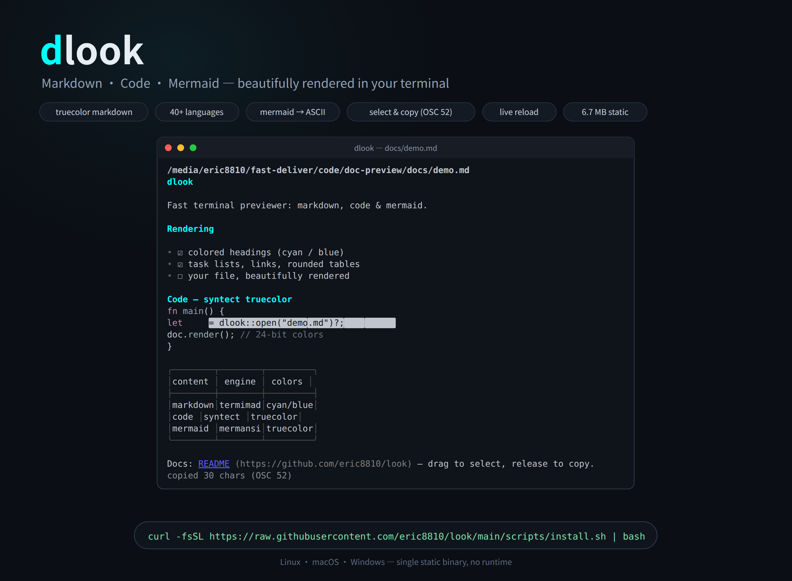
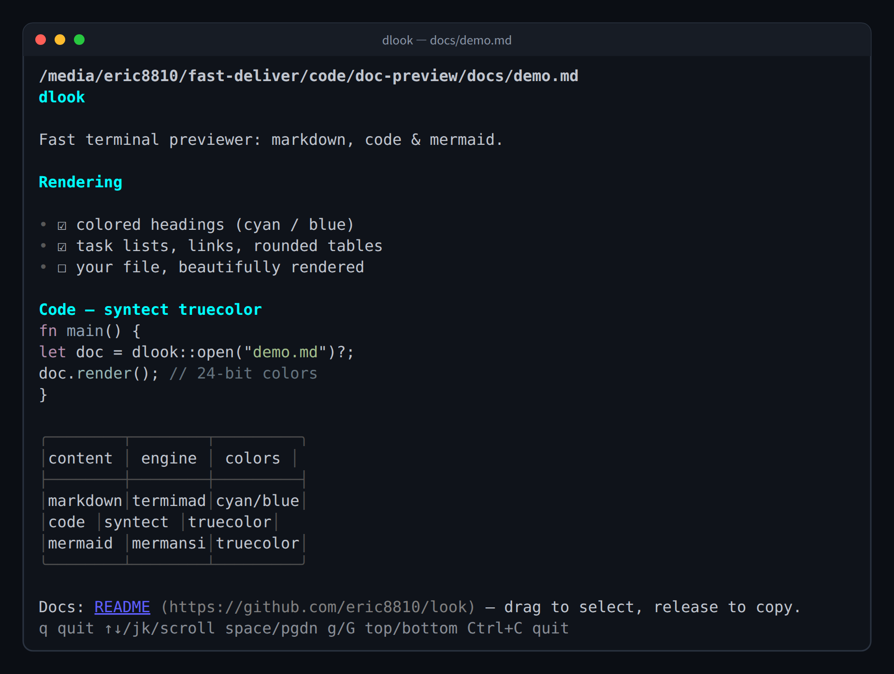
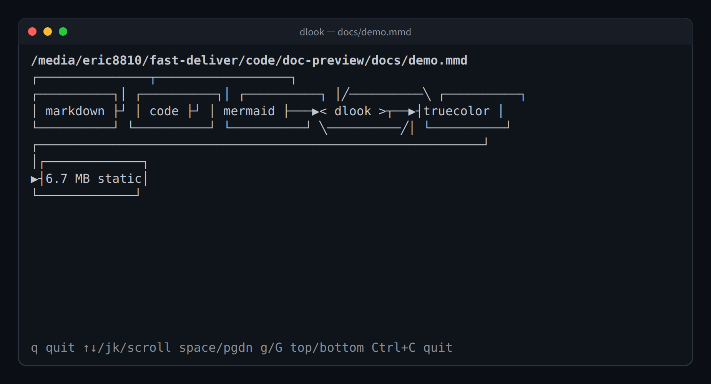

<div align="center">



# dlook

**Markdown · Code · Mermaid — beautifully rendered in your terminal.**

[](https://github.com/eric8810/look/releases)
[](LICENSE)
[](https://github.com/eric8810/look/releases/latest)
[](https://github.com/eric8810/look/releases/latest)
[](rs/)

```bash
curl -fsSL https://raw.githubusercontent.com/eric8810/look/main/scripts/install.sh | bash
```

Linux · macOS · Windows — single static binary, no runtime, starts instantly.

</div>

---

## Why dlook?

You `cat` a README and get a wall of raw markdown. You open a `.ts` file and see
plain text. You find a `flowchart.mmd` and have no idea what it draws.
**dlook renders all three, in truecolor, in a pager you already know how to use.**

| | dlook |
|---|---|
| 🎨 **Markdown** | colored headings (h1/h2 cyan, h3/h4 blue), task lists `☑/☐`, rounded tables, styled links, quotes, strikethrough |
| 🖍️ **Code** | token-level **24-bit truecolor** highlighting — 40+ languages incl. TypeScript, Vue, Svelte, TOML, GraphQL, Dockerfile, PowerShell |
| 📈 **Mermaid** | 28 diagram types rendered to **truecolor ASCII art** — no browser, no node |
| 🖱️ **Selection** | drag to select (reversed highlight, edge auto-scroll), release to copy via **OSC 52** — works over SSH |
| 🔥 **Live reload** | watches the file and re-renders on every save |
| 📦 **Tiny & static** | ~6.7 MB binary, zero runtime, instant startup |

```bash
$ dlook README.md      # markdown: headings / tasks / tables / links
$ dlook src/main.rs    # code: truecolor syntax highlight
$ dlook flow.mmd       # mermaid: ASCII art diagram
$ dlook plain.txt      # plain text
```

## Screenshots

Real renders, captured from the binary (regenerate with `python3 scripts/gen-promo.py`):

<p align="center">
  
</p>

<p align="center">
  
</p>

## Install

### One-liner (prebuilt binary, no Rust toolchain needed)

```bash
curl -fsSL https://raw.githubusercontent.com/eric8810/look/main/scripts/install.sh | bash
```

Auto-detects your platform (Linux/macOS, x86_64/aarch64) and installs to
`~/.local/bin`. Customize with env vars — note they must apply to the `bash`
on the right side of the pipe, not to `curl`:

```bash
curl -fsSL https://raw.githubusercontent.com/eric8810/look/main/scripts/install.sh \
  | sudo env VERSION=v0.2.0 INSTALL_DIR=/usr/local/bin bash
```

Windows: download [`dlook-x86_64-pc-windows-msvc.zip`](https://github.com/eric8810/look/releases/latest) from Releases and unzip.

### From source

```bash
cd rs
cargo build --release
./target/release/dlook README.md
```

## Keys

| Key | Action |
|---|---|
| `q` / `Esc` | Quit (exit 0) |
| `j` / `k` | Scroll down / up one line |
| `Space` / `PageDown` | Scroll down one page |
| `PageUp` | Scroll up one page |
| `g` / `G` | Go to top / bottom |
| `↑` `↓` | Scroll one line |
| `Home` / `End` | Go to top / bottom |
| `Ctrl+C` | Quit (exit 130) |
| Mouse wheel | Scroll up / down |
| Mouse drag | Select text (reversed highlight); auto-scrolls at viewport edges |
| Release mouse | Copy selection to clipboard via **OSC 52** (works over SSH) |
| `Shift` + click | Extend selection |
| `y` / `Enter` | Copy active selection (OSC 52) |
| `Esc` | Clear selection — quits only when no selection is active |

> Tip: your terminal's **native** selection still works with `Shift` + drag
> (the app enables mouse reporting, so plain drag is captured by the app).

## Behavior

- **Markdown** (`.md`/`.markdown`): rendered by `termimad` — colored headings,
  nested lists, task lists, rounded-border tables with per-column alignment,
  quotes, strikethrough; inline links render as a blue underlined label + gray URL.
  Fenced code blocks are syntax-highlighted; ` ```mermaid ` blocks render as diagrams.
- **Mermaid** (`.mmd`/`.mermaid`): rendered to truecolor ASCII art via `mermansi`.
- **Code / text**: token-level truecolor highlighting via `syntect` with the
  **two-face** full syntax set; long lines are truncated (`less -S` style).
- **Unknown extension**: uncolored plain text.
- **Binary files** (NUL byte in first 8KB): refused, exit 1.
- **Non-TTY** (piped): raw content to stdout, exit 0 — no TUI
  (mermaid files are rendered to ASCII first). `dlook x.md | grep` just works.
- **Live reload**: re-renders on file change.

### Exit codes

| Situation | Code |
|---|---|
| Normal quit (`q`/`Esc`) | 0 |
| Bad arguments (none / too many) | 2 |
| File not found / unreadable / binary / directory | 1 |
| `Ctrl+C` | 130 |

## How it works

- **Mode dispatch** (`rs/src/main.rs`): argv → binary check → mode detection
  (markdown / mermaid / code) → non-TTY passthrough → TUI loop.
- **One rendering pipeline**: every content type converges to
  `Vec<StyledLine>` — termimad + syntect + mermansi all emit ANSI, converted
  via `ansi-to-tui`, painted by a single ratatui viewport widget.
- **Selection** (`rs/src/selection.rs`): mouse drag builds a selection in
  *content coordinates* (stable across scrolling); the viewport renders
  selected spans reversed; releasing copies the text via OSC 52.
- **Packaging**: `cargo build --release` with size-focused profile
  (`opt-level=z`, fat LTO, strip, `panic=abort`). CI builds per-target
  binaries on tag push and attaches them to the GitHub Release.

```
rs/src/
  main.rs       entry: argv + binary detection + mode dispatch
  args.rs       argv parsing + --help/--version
  content.rs    file reading + binary detection + hot reload
  lang.rs       extension → mode + syntax token mapping
  highlight.rs  syntect (two-face) highlighter
  markdown.rs   termimad rendering + task checkboxes + link styling + table frame
  mermaid.rs    mermaid → truecolor ASCII art (mermansi)
  selection.rs  text selection model (content coords, highlight, copy text)
  doc.rs        Doc.lines + scroll math
  viewport.rs   scroll viewport + selection highlight
  termio.rs     crossterm setup + event loop + keys/wheel/mouse-drag + resize
  ansi_lines.rs ANSI → ratatui lines
```

## Testing

Three layers, all green:

| Suite | Command | Coverage |
|---|---|---|
| Unit (Rust) | `cd rs && cargo test` | link scanner, task checkboxes, table framing, selection model |
| E2E (pty + pyte) | `BIN=rs/target/release/dlook python3 test/e2e/run_acceptance.py` | 96 checks: rendering, scrolling, resize, exit codes, non-TTY, markdown styling, selection, language coverage (A–L) |
| E2E (tmux, real terminal) | `BIN=rs/target/release/dlook bash test/e2e/run-tmux.sh` | 33 checks: incl. **OSC 52 clipboard content** verification, mouse injection, resize, exit codes (T1–T29) |

## Documentation

- [DESIGN.md](DESIGN.md) — original Node/vue-tui design
- [DESIGN-rust.md](DESIGN-rust.md) — Rust rewrite design
- [GAP.md](GAP.md) — vue-tui vs Rust rendering capability analysis
- [DECISIONS.md](DECISIONS.md) — decision log for the feature set (D1–D11)

## License

[MIT](LICENSE)
