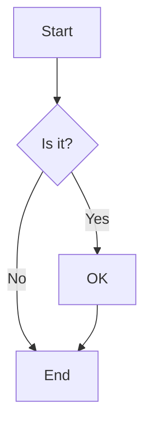

# Mermaid in Markdown

This file contains a mermaid diagram block.

```mermaid
flowchart TD
    A[Start] --> B{Is it?}
    B -- Yes --> C[OK]
    B -- No --> D[End]
    C --> D
```

And some text after the diagram.
